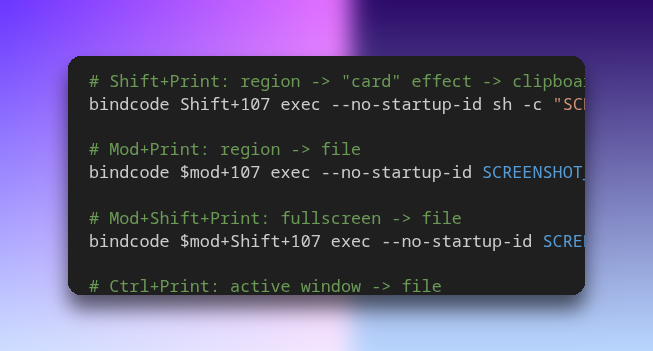

# cool-screenshots

A tiny X11 screenshot helper for i3.

It provides fast keybind-friendly modes (region/window/fullscreen) plus an optional "macOS-ish card" effect (rounded screenshot + drop shadow on a colorful gradient background) and copies the result to the clipboard as PNG.

## Example

`Shift+Print` (`select-clip-effects`):



## Requirements

Debian packages (recommended):

```bash
sudo apt install scrot xclip imagemagick xfce4-screenshooter libnotify-bin
```

Notes:
- `xfce4-screenshooter` is optional but recommended for reliable region selection. The script will fall back to `scrot`.
- Wayland is not supported (this is X11 tooling: `xclip`, `scrot`, `xfce4-screenshooter`).

## Install

```bash
./install.sh
```

Then add the i3 keybinds from `i3/snippet.conf` into your i3 config (commonly `~/.config/i3/config`) and reload i3 (`$mod+Shift+c`).

## i3 Keybinds

This repo ships a ready-to-paste block at `i3/snippet.conf`.

It uses `bindcode 107` to avoid the common `Print` vs `Sys_Req` keysym weirdness on some keyboards/layouts.

Default binds in that snippet:
- `Print`: region -> clipboard
- `Shift+Print`: region -> card effect -> clipboard (with debug logging to `~/.cache/i3-screenshot.log`)
- `Mod+Print`: region -> file
- `Mod+Shift+Print`: fullscreen -> file
- `Ctrl+Print`: active window -> file
- `Ctrl+Shift+Print`: active window -> clipboard

## Script Modes

The installed command is `i3-screenshot`:

- `i3-screenshot save` : fullscreen -> file (`$SCREENSHOT_DIR/YYYY-MM-DD_HH-MM-SS.png`)
- `i3-screenshot clip` : fullscreen -> clipboard
- `i3-screenshot select` : region -> file
- `i3-screenshot select-clip` : region -> clipboard
- `i3-screenshot select-clip-effects` : region -> card effect -> clipboard
- `i3-screenshot window` : active window -> file
- `i3-screenshot window-clip` : active window -> clipboard

## Effect Customization

`select-clip-effects` creates a rounded "card", drops a gray shadow, and composites it on a gradient background.

Tuning env vars (defaults are in `bin/i3-screenshot`):
- `SCREENSHOT_RADIUS`
- `SCREENSHOT_PAD`
- `SCREENSHOT_SHADOW` (format: `opacityxsigma+x+y`, example `60x10+0+14`)
- `SCREENSHOT_SHADOW_RGBA` (example `rgba(0,0,0,0.35)`)
- `SCREENSHOT_BG_A`, `SCREENSHOT_BG_B`, `SCREENSHOT_BG_C`, `SCREENSHOT_BG_D`
- `SCREENSHOT_BG_PAD_X`, `SCREENSHOT_BG_PAD_Y`
- `SCREENSHOT_TRIM` (shaves pixels off the capture edge to remove selection outlines)
- Mask anti-aliasing:
  - `SCREENSHOT_MASK_SCALE`
  - `SCREENSHOT_MASK_BLUR`
  - `SCREENSHOT_MASK_FILTER`
  - `SCREENSHOT_MASK_FILTER_BLUR`

Example:

```bash
SCREENSHOT_SHADOW="55x14+0+18" SCREENSHOT_SHADOW_RGBA="rgba(0,0,0,0.30)" \
SCREENSHOT_BG_PAD_X=70 SCREENSHOT_BG_PAD_Y=50 \
i3-screenshot select-clip-effects
```

## Debugging

Enable logging:

```bash
SCREENSHOT_LOG=~/.cache/i3-screenshot.log i3-screenshot select-clip-effects
tail -n 200 ~/.cache/i3-screenshot.log
```

If a keybind doesn't fire, check what your Print key reports:

```bash
xev -event keyboard
```

(This repo's i3 snippet uses keycode `107` specifically to avoid most of those issues.)
